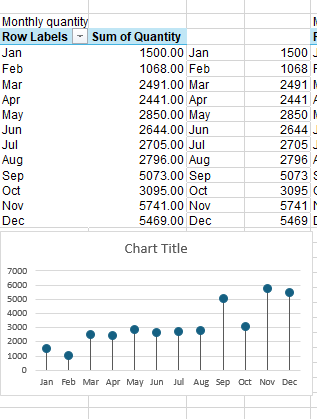
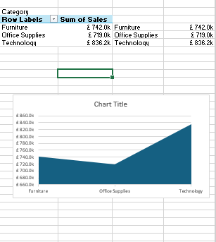

# Excel: Sales Performance Analysis

# Table of contents 

- [Objective](#objective)
- [Questions to answer](#Questionstoanswer)
- [Data Source](#data-source)
- [Tools](#tools)
- [Stages](#stages)
  - [Data Cleaning](#data-cleaning)
  - [Data Processing](#DataProcessing)
- [Design](#design)
- [Visualization](#visualization)
- [Insights](#Insights)
- [Recommendations](#recommendations)
  
# Objective
To analyze and visualize key sales performance metrics, identify top-selling products, highlight monthly sales trends, and uncover opportunities for growth. This analysis helps stakeholders make data-driven decisions by providing clear insights into sales, profit, customer segments, and shipping methods.

# Questions-Answer

1.  What is our total sales and profit over the selected period?

2.  Which months have the highest and lowest sales performance?

3.  What are our most and least profitable product sub-categories?

4.  How do product categories (Technology, Furniture, Office Supplies) compare in sales?

5.  What trends can we see in monthly sales and order quantities?

6.  Which customer segment contributes the most to our revenue?

7.  What shipment mode is most commonly used, and how does it relate to sales performance?

8.  How have sales changed year over year — is there consistent growth?

9.  Are there seasonal patterns or specific months we should focus on for marketing and inventory planning?

10. Where should we focus our efforts to improve profit margins and overall performance?

# Data Source

# Tools

Excel Spreadsheet

# Stages

Data cleaning & Processing

- Functions and Formulas

- Pivot tables

- Removing duplicates

- Average imputation into blank cells

# Dashboard Design

- Line chart
  
- 

- Lollipop chart

- Tree map

- Donut chart

- KPI cards

- Area chart

- Column 

- Bar charts

# Visualization

# Insights 

1.	Total Sales of £2,297.2k, Total Profit of £286.4k and Profit Margin of 12.47%.
  
2.	Sales steadily climb from about £150k in January to £220k in December. Order quantities rise in a similar pattern: from 500 units sold in January to 900 units in December. The fastest
   growth occurs in the last 6 month of the year (July-December). 
3.	Technology is the top-seller at roughly £1.1m per year. Office Supplies come in second at about £600k, and Furniture at £500k.
    
4.	Phones £800k and Chairs £700k are standout subcategories.
   
5.	Binders £100k and Copiers £90k are underperforming.
   
6.	Consumer segment accounts for 40% of sales, Corporate 35%, and Home Office 25%. Standard Class shipping makes up 50% of orders.
    
7.	Overall margin sits at 12.5%, but it likely varies by category. 

# Recommendations

1.	Double-down on the best-sellers.
   
2.	Improve underperforming lines.
   
3.	Seasonal Push for marketing campaigns.
   
4.	Optimize Shipping Mix.
   
5.	Segment-Specific Offers.
